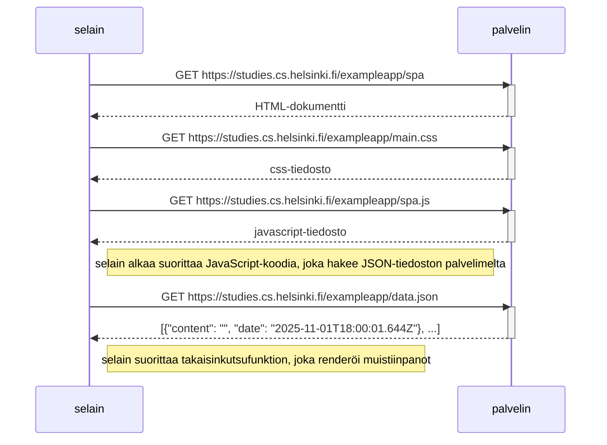

```mermaid

 sequenceDiagram
    participant selain
    participant palvelin
    
    selain->>palvelin: GET https://studies.cs.helsinki.fi/exampleapp/spa
    activate palvelin
    palvelin-->>selain: HTML-dokumentti
    deactivate palvelin
    
    selain->>palvelin: GET https://studies.cs.helsinki.fi/exampleapp/main.css
    activate palvelin
    palvelin-->>selain: css-tiedosto
    deactivate palvelin
    
    selain->>palvelin: GET https://studies.cs.helsinki.fi/exampleapp/spa.js
    activate palvelin
    palvelin-->>selain: javascript-tiedosto
    deactivate palvelin
    
    Note right of selain: selain alkaa suorittaa JavaScript-koodia, joka hakee JSON-tiedoston palvelimelta
    
    selain->>palvelin: GET https://studies.cs.helsinki.fi/exampleapp/data.json
    activate palvelin
    palvelin-->>selain: [{"content": "", "date": "2025-11-01T18:00:01.644Z"}, ...]
    deactivate palvelin    

    Note right of selain: selain suorittaa takaisinkutsufunktion, joka renderöi muistiinpanot


```
