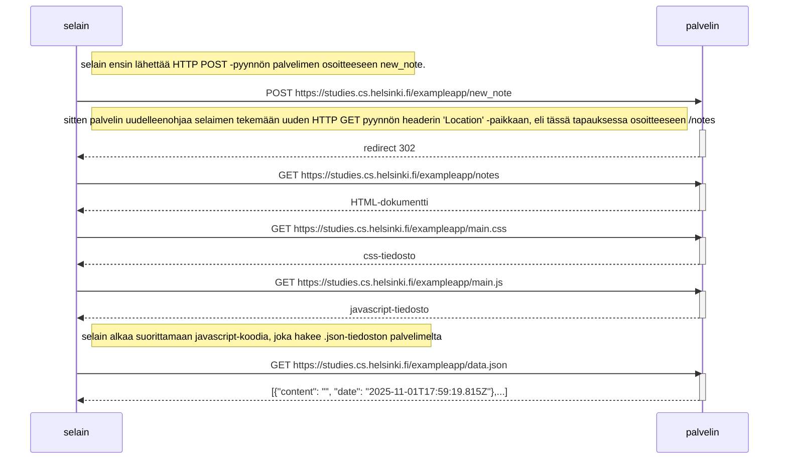

```mermaid

  sequenceDiagram
    participant selain
    participant palvelin

    Note right of selain: selain ensin lähettää HTTP POST -pyynnön palvelimen osoitteeseen new_note.
    selain->>palvelin: POST https://studies.cs.helsinki.fi/exampleapp/new_note

    Note left of palvelin: sitten palvelin uudelleenohjaa selaimen tekemään uuden HTTP GET pyynnön headerin 'Location' -paikkaan, eli tässä tapauksessa osoitteeseen /notes

    activate palvelin
    palvelin-->>selain: redirect 302
    deactivate palvelin

    selain->>palvelin: GET https://studies.cs.helsinki.fi/exampleapp/notes

    activate palvelin
    palvelin-->>selain: HTML-dokumentti
    deactivate palvelin

    selain->>palvelin: GET https://studies.cs.helsinki.fi/exampleapp/main.css

    activate palvelin
    palvelin-->>selain: css-tiedosto
    deactivate palvelin
    
    selain->>palvelin: GET https://studies.cs.helsinki.fi/exampleapp/main.js

    activate palvelin
    palvelin-->>selain: javascript-tiedosto
    deactivate palvelin
    Note right of selain: selain alkaa suorittamaan javascript-koodia, joka hakee .json-tiedoston palvelimelta

    selain->>palvelin: GET https://studies.cs.helsinki.fi/exampleapp/data.json

    activate palvelin
    palvelin-->>selain: [{"content": "", "date": "2025-11-01T17:59:19.815Z"},...]
    
    deactivate palvelin


```
