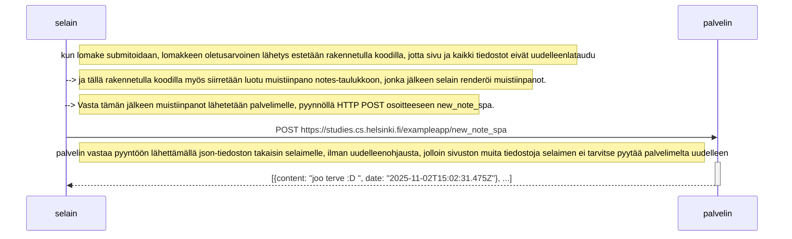

```mermaid

  sequenceDiagram
    participant selain
    participant palvelin

    Note right of selain: kun lomake submitoidaan, lomakkeen oletusarvoinen lähetys estetään rakennetulla koodilla, jotta sivu ja kaikki tiedostot eivät uudelleenlataudu
    Note right of selain: --> ja tällä rakennetulla koodilla myös siirretään luotu muistiinpano notes-taulukkoon, jonka jälkeen selain renderöi muistiinpanot. 
    Note right of selain: --> Vasta tämän jälkeen muistiinpanot lähetetään palvelimelle, pyynnöllä HTTP POST osoitteeseen new_note_spa.

    selain->>palvelin: POST https://studies.cs.helsinki.fi/exampleapp/new_note_spa

    Note left of palvelin: palvelin vastaa pyyntöön lähettämällä json-tiedoston takaisin selaimelle, ilman uudelleenohjausta, jolloin sivuston muita tiedostoja selaimen ei tarvitse pyytää palvelimelta uudelleen

    activate palvelin
    palvelin-->>selain: [{content: "joo terve :D ", date: "2025-11-02T15:02:31.475Z"}, ...]
    deactivate palvelin

```
